<!-- =======================
      PROFILE README — Eduardo Cornejo
======================== -->

  

 

---
<!-- ═══════════════════════════════════════════════════════════════ -->
<!--                             About                               -->
<!-- ═══════════════════════════════════════════════════════════════ -->
# 👨‍💻 About

Full Stack Developer focused on building scalable APIs and clean frontend architectures.

**Practices**

SOLID • Clean Code • DRY • REST APIs 

---
<!-- ═══════════════════════════════════════════════════════════════ -->
<!--                           Tech Stack                            -->
<!-- ═══════════════════════════════════════════════════════════════ -->

<h2 align="center">🧰 Tech Stack</h2>

---
<!-- ═══════════════════════════════════════════════════════════════ -->
<!--                           Statistics                            -->
<!-- ═══════════════════════════════════════════════════════════════ -->
## 📊 Statistics

    

<!-- ═══════════════════════════════════════════════════════════════ -->
<!--                              Metrics                            -->
<!-- ═══════════════════════════════════════════════════════════════ -->

<h2 align="center">Metrics</h2>

  

<!-- ═══════════════════════════════════════════════════════════════ -->
<!--                          Contributions                          -->
<!-- ═══════════════════════════════════════════════════════════════ -->
<h2></h2>
# 🐍 Contributions

<picture>
  <source media="(prefers-color-scheme: dark)" srcset="https://raw.githubusercontent.com/EdouardoCornejo/EdouardoCornejo/output/github-snake-dark.svg"/>
  <source media="(prefers-color-scheme: light)" srcset="https://raw.githubusercontent.com/EdouardoCornejo/EdouardoCornejo/output/github-snake.svg"/>
  
</picture>

<!-- ═══════════════════════════════════════════════════════════════ -->
<!--                          NOW PLAYING                          -->
<!-- ═══════════════════════════════════════════════════════════════ -->

  

  

  

  

  

