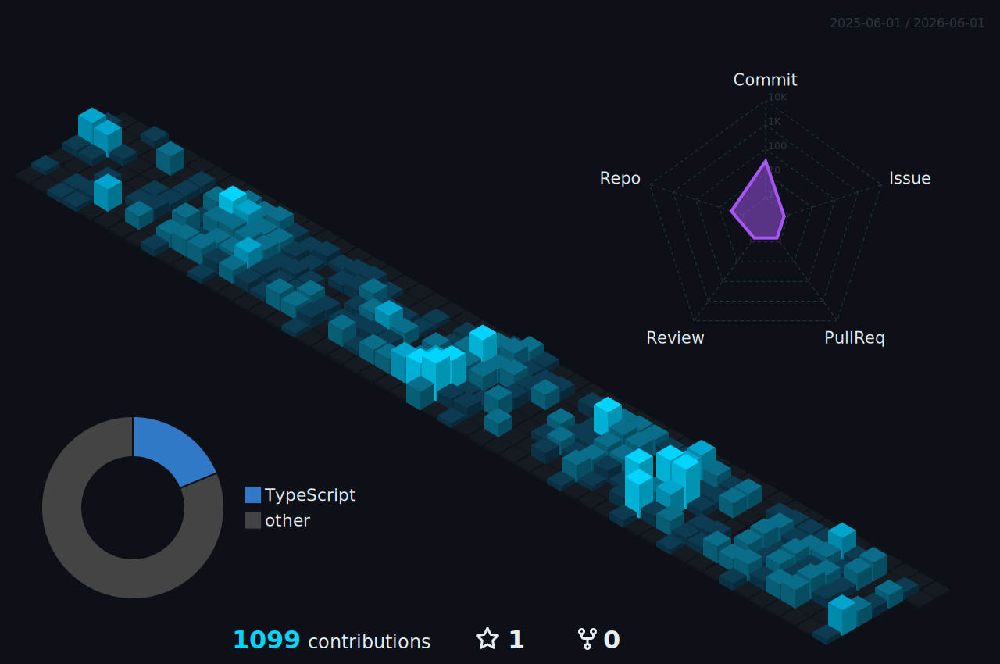

<!-- ╔══════════════════════════════════════════════════════════════╗
     ║            PROFILE README — Eduardo Cornejo                 ║
     ║            Theme: Cyber Night · Cyan + Purple               ║
     ╚══════════════════════════════════════════════════════════════╝ -->

<!-- ═══════════════════════════════════════════════════════════════ -->
<!--                          HEADER                               -->
<!-- ═══════════════════════════════════════════════════════════════ -->

 

 

  

<!-- ═══════════════════════════════════════════════════════════════ -->
<!--                         ABOUT ME                              -->
<!-- ═══════════════════════════════════════════════════════════════ -->

<h2 align="center">
  
  &nbsp;About Me
</h2>

Full Stack Developer focused on building **scalable APIs** and **clean frontend architectures**.

 

🏗️ &nbsp;Specialist in **React · NestJS · Prisma · TypeScript** 
🧠 &nbsp;Passionate about **Clean Code · SOLID · DRY · REST APIs** 
🎯 &nbsp;Interests: **System Design · Cloud Architecture · Developer Experience** 
🚀 &nbsp;Goal: Build **high-impact digital products** with maintainable code 
📖 &nbsp;Always learning — exploring **AI · Microservices · Cloud Native** 
💬 &nbsp;Ask me about **NestJS, React, Prisma, System Design**

<!-- ═══════════════════════════════════════════════════════════════ -->
<!--                      CODE PHILOSOPHY                          -->
<!-- ═══════════════════════════════════════════════════════════════ -->

<h2 align="center">⚡ Code Philosophy</h2>

<!-- ═══════════════════════════════════════════════════════════════ -->
<!--                        TECH STACK                             -->
<!-- ═══════════════════════════════════════════════════════════════ -->

<h2 align="center">
  
  &nbsp;Tech Stack
</h2>

<!-- ═══════════════════════════════════════════════════════════════ -->
<!--                     GITHUB ANALYTICS                          -->
<!-- ═══════════════════════════════════════════════════════════════ -->

<h2 align="center">
  
  &nbsp;GitHub Analytics
</h2>

<table align="center">
  <tr>
    <td align="center">
      
    </td>
    <td align="center">
      
    </td>
  </tr>
  <tr>
    <td align="center">
      
    </td>
    <td align="center">
      
    </td>
  </tr>
</table>

<!-- ═══════════════════════════════════════════════════════════════ -->
<!--                       ACHIEVEMENTS                            -->
<!-- ═══════════════════════════════════════════════════════════════ -->
<!-- 
<h2 align="center">🏆 Achievements</h2>

 -->

<!-- ═══════════════════════════════════════════════════════════════ -->
<!--                     PROFILE SUMMARY                           -->
<!-- ═══════════════════════════════════════════════════════════════ -->

<h2 align="center">📊 Profile Summary</h2>

&nbsp;

&nbsp;

 

<!-- ═══════════════════════════════════════════════════════════════ -->
<!--                  3D CONTRIBUTION SKYLINE                      -->
<!-- ═══════════════════════════════════════════════════════════════ -->

<h2 align="center">🌃 3D Contribution Skyline</h2>

<picture>
  <source media="(prefers-color-scheme: dark)" srcset="./profile-3d-contrib/profile-cyber-night.svg" />
  <source media="(prefers-color-scheme: light)" srcset="./profile-3d-contrib/profile-cyber-night-static.svg" />
  
</picture>

<!-- ═══════════════════════════════════════════════════════════════ -->
<!--                    SNAKE CONTRIBUTIONS                        -->
<!-- ═══════════════════════════════════════════════════════════════ -->

<h2 align="center">🎮🐍👾 Contributions</h2>

<picture>
  <source media="(prefers-color-scheme: dark)" srcset="https://raw.githubusercontent.com/EdouardoCornejo/EdouardoCornejo/output/github-snake-dark.svg"/>
  <source media="(prefers-color-scheme: light)" srcset="https://raw.githubusercontent.com/EdouardoCornejo/EdouardoCornejo/output/github-snake.svg"/>
  
</picture>

<picture>
    <source media="(prefers-color-scheme: dark)" srcset="https://raw.githubusercontent.com/EdouardoCornejo/EdouardoCornejo/output/pacman-contribution-graph-dark.svg">
    <source media="(prefers-color-scheme: light)" srcset="https://raw.githubusercontent.com/EdouardoCornejo/EdouardoCornejo/output/pacman-contribution-graph.svg">
    
</picture>

<!-- ═══════════════════════════════════════════════════════════════ -->
<!--                    SPOTIFY NOW PLAYING                        -->
<!-- ═══════════════════════════════════════════════════════════════ -->

  

  

  

  

<!-- ═══════════════════════════════════════════════════════════════ -->
<!--                          FOOTER                               -->
<!-- ═══════════════════════════════════════════════════════════════ -->

 

